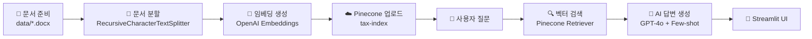

# 소득세 AI 챗봇 (Income Tax AI Chatbot)

소득세에 관련된 질문에 AI가 답변해주는 스트림릿 기반 웹 애플리케이션입니다.

## 🎯 프로젝트 개요

사용자가 소득세에 대해 궁금한 내용을 질문하면, AI가 실시간으로 답변을 제공하는 대화형 챗봇 서비스입니다.

## 🛠️ 기술 스택

- **Frontend**: Streamlit
- **AI/LLM**: LangChain + OpenAI API
- **환경 변수 관리**: python-dotenv
- **언어**: Python

## 📂 프로젝트 구조

```
ai_shcool_streamlit/
├── app.py                    # 메인 Streamlit 애플리케이션
├── llm.py                    # LLM 처리 로직
├── config.py                 # 설정 파일
├── requirements.txt          # 패키지 의존성
├── .env                      # 환경 변수 (API 키 등)
├── 01_tax_exam.ipynb        # 세금 시험 관련 노트북
└── AICA_2025_08_13.ipynb    # AICA 학습 자료
```

## 🚀 실행 방법

### 1. 패키지 설치
```bash
pip install -r requirements.txt
```

### 2. 환경 변수 설정
`.env` 파일을 생성하고 필요한 API 키를 설정합니다:
```
OPENAI_API_KEY=your_api_key_here
```

### 3. 애플리케이션 실행
```bash
streamlit run app.py
```

## ✨ 주요 기능

- 💬 **실시간 채팅 인터페이스**: Streamlit의 chat UI 활용
- 🤖 **AI 기반 답변**: LLM을 활용한 소득세 관련 질문 응답
- 📝 **세션 상태 관리**: 대화 히스토리 유지
- ⏳ **스트리밍 응답**: 실시간으로 AI 답변 출력

## � 학습 워크플로우 가이드

이 프로젝트는 학습용으로 제작되었으며, 다음은 AI 챗봇의 전체 데이터 파이프라인입니다.

### 1️⃣ 데이터 준비

#### 데이터 소스
- **문서 형식**: `.docx` 파일 (Word 문서)
- **내용**: 소득세법 관련 문서
- **위치**: `data/` 폴더에 저장 (`.gitignore`에 포함되어 있음)

#### 데이터 준비 예시
```python
# 예: data/income_tax_law.docx
# 소득세법 제4조, 제5조, 제123조 등의 조문이 포함된 문서
```

---

### 2️⃣ Pinecone 벡터 데이터베이스 설정

#### Pinecone이란?
이 프로젝트는 **Pinecone 클라우드 벡터 데이터베이스**를 사용하여 문서를 저장하고 검색합니다.  
로컬 `data/` 폴더는 업로드 전 원본 문서 보관용이며, **실제 AI는 Pinecone에서 데이터를 가져옵니다.**

#### 환경 변수 설정
`.env` 파일에 다음 API 키들을 추가하세요:
```env
OPENAI_API_KEY=your_openai_api_key_here
PINECONE_API_KEY=your_pinecone_api_key_here
```

#### Pinecone에 데이터 업로드하기

별도의 `upload_to_pinecone.py` 스크립트를 생성하여 다음 단계를 수행합니다:

**1. 문서 로드**
- `.docx` 파일에서 텍스트를 추출합니다
- 사용 도구: `Docx2txtLoader`

**2. 문서를 작은 청크로 분할**
- **왜 필요한가?**: 전체 문서가 너무 크면 AI가 한 번에 처리하기 어렵고, 검색 시 정확도가 떨어집니다
- **어떻게?**: 1000자 단위로 분할하되, 200자는 겹치게 설정 (문맥 유지)
- 사용 도구: `RecursiveCharacterTextSplitter`

**3. 임베딩 생성**
- **왜 필요한가?**: 텍스트를 숫자 벡터로 변환해야 의미 기반 검색이 가능합니다
- **어떻게?**: OpenAI의 `text-embedding-3-large` 모델로 각 청크를 벡터로 변환
- 사용 도구: `OpenAIEmbeddings`

**4. Pinecone 인덱스에 업로드**
- **왜 필요한가?**: 벡터를 저장하고 빠르게 검색하기 위해 벡터 데이터베이스에 저장합니다
- **어떻게?**: `tax-index`라는 이름의 Pinecone 인덱스에 모든 벡터를 업로드
- 사용 도구: `PineconeVectorStore.from_documents()`

> 💡 **참고**: `llm.py` 파일의 `Docx2txtLoader` import 부분을 참고하여 스크립트를 작성할 수 있습니다.

---

### 3️⃣ Few-shot 예시 추가하기

Few-shot 예시는 AI가 원하는 형식으로 답변하도록 가이드하는 역할을 합니다.

#### 예시 추가 위치
`config.py` 파일의 `answer_examples` 리스트에 추가하세요.

#### 추가 방법
```python
# config.py

answer_examples = [
  {
    "input": "소득은 어떻게 구분되나요?",
    "answer": """소득세법 제 4조(소득의 구분)에 따르면 소득은 아래와 같이 구분됩니다.
    
    1. 종합소득
      - 이자소득, 배당소득, 사업소득, 근로소득, 연금소득, 기타소득
    2. 퇴직소득
    3. 양도소득   
    """
  },
  # 새로운 예시 추가
  {
    "input": "종합소득세 신고 기한은 언제인가요?",
    "answer": """소득세법 제70조(과세표준 확정신고)에 따르면,
    종합소득이 있는 거주자는 다음 연도 5월 1일부터 5월 31일까지 
    종합소득세 과세표준 확정신고를 해야 합니다.
    """
  }
]
```

#### Few-shot 예시 작성 팁
1. **법 조항 인용**: "소득세법 제XX조에 따르면" 형식으로 시작
2. **간결한 답변**: 2~3문장으로 핵심만 전달
3. **구조화**: 리스트나 단락을 활용하여 가독성 높이기

---

### 4️⃣ 전체 워크플로우 정리



1. **데이터 준비**: `.docx` 문서를 `data/` 폴더에 저장
2. **업로드**: `upload_to_pinecone.py` 스크립트로 Pinecone에 업로드
3. **Few-shot 설정**: `config.py`에 예시 추가
4. **실행**: `streamlit run app.py`로 챗봇 실행
5. **질문**: 사용자가 질문하면 Pinecone에서 관련 문서를 검색하여 AI가 답변

---

## 🔧 데이터베이스 구조

### Pinecone 인덱스 정보
- **인덱스 이름**: `tax-index`
- **임베딩 모델**: `text-embedding-3-large` (OpenAI)
- **검색 방식**: 벡터 유사도 검색 (Top-K=3)

### 데이터 흐름
```
사용자 질문 
  → 질문 변환 (Dictionary Chain)
  → 이전 대화 고려 (History-Aware Retriever)
  → Pinecone 벡터 검색 (관련 문서 3개 추출)
  → GPT-4o 답변 생성 (Few-shot 예시 참고)
  → 스트리밍 출력
```

---

## �📌 참고사항

- 이 프로젝트는 **AI 학습 목적**으로 제작되었습니다.
- **Pinecone 무료 티어**: 최대 100,000개 벡터까지 무료로 사용 가능
- **로컬 데이터**: `data/` 폴더는 Git에 공유되지 않으므로 각자 준비 필요
- **API 비용**: OpenAI API 호출 시 비용이 발생할 수 있습니다.
